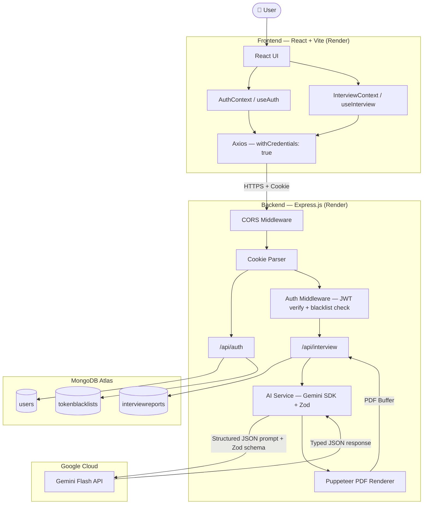

# ResuMatch — AI-Powered Interview Strategy Platform

[](https://nodejs.org/)
[](https://react.dev/)
[](https://www.mongodb.com/atlas)
[](https://ai.google.dev/)
[](https://render.com/)

> ResuMatch analyzes your resume and a target job description using Google Gemini AI to generate a personalized interview strategy — including tailored technical and behavioral questions, a skill-gap analysis, a day-by-day preparation roadmap, interactive study rooms with MCQ quizzes, and an AI-generated resume PDF.

---

## 🌐 Live Demo

| Service | URL |
|---------|-----|
| **Frontend** | [https://resumatch-frontend-anab.onrender.com](https://resumatch-frontend-anab.onrender.com) |
| **Backend API** | [https://resumatch-backend-6fho.onrender.com](https://resumatch-backend-6fho.onrender.com) |

---

## ✨ Key Features

| Feature | Description |
|---------|-------------|
| **Resume & JD Analysis** | Upload a PDF resume (up to 3 MB) or write a self-description alongside a job description |
| **AI Interview Report** | Gemini generates a job-match score, 10+ technical questions, and 10+ behavioral questions — each with the interviewer's intention, a model answer, and a strategic tip |
| **Skill Gap Analysis** | Identifies missing skills relative to the job, each rated low / medium / high severity |
| **Preparation Roadmap** | Day-by-day study plan with a focus topic and concrete daily tasks |
| **Interactive Study Rooms** | Per-topic deep-dive with overview, core concepts, beginner explanation, technical content, code examples, interview tips, common mistakes, and FAQs |
| **MCQ Quiz** | 5–10 AI-generated multiple-choice questions per topic with instant grading, answer explanations, and score tracking |
| **Learning Progress Tracker** | Tracks completed topics and quiz scores; an overall progress bar is displayed on the interview dashboard |
| **AI Resume PDF Generator** | Generates an ATS-friendly, job-tailored HTML resume rendered to a downloadable PDF via Puppeteer |
| **User Authentication** | Secure register, login, and logout with JWT stored in `httpOnly` cookies |
| **Protected Routes** | All interview features require authentication; unauthenticated users are redirected to `/login` |
| **Session Persistence** | Cookie-based session survives page refreshes |
| **Recent Reports Dashboard** | Home page lists past interview plans with title, date, and match score |

---

## 🛠️ Tech Stack

### Frontend

| Technology | Version | Purpose |
|-----------|---------|---------|
| React | 19 | UI framework |
| React Router | v7 | Client-side routing |
| Axios | latest | HTTP client (`withCredentials: true` for cookie auth) |
| Vite | 7 | Build tool and dev server |
| Sass (Dart Sass) | 1.97+ | Component-level SCSS styling |

### Backend

| Technology | Version | Purpose |
|-----------|---------|---------|
| Node.js | 24 | Runtime |
| Express | 5 | Web framework |
| Mongoose | 9 | MongoDB ODM |
| jsonwebtoken | 9 | JWT signing and verification |
| bcryptjs | 3 | Password hashing (10 salt rounds) |
| cookie-parser | 1.4 | Cookie reading middleware |
| cors | 2.8 | Cross-origin resource sharing |
| multer | 2 | Multipart PDF upload (memory storage, 3 MB limit) |
| pdf-parse | 2.4 | PDF text extraction |
| Puppeteer | 24 | Headless Chrome for PDF generation |
| dotenv | 17 | Environment variable loading |

### AI

| Technology | Purpose |
|-----------|---------|
| `@google/genai` SDK | Calls Google Gemini API (model: `gemini-3.6-flash`) |
| Zod + zod-to-json-schema | Defines structured output schemas; forces Gemini to return valid, typed JSON |

### Database & Hosting

| Technology | Purpose |
|-----------|---------|
| MongoDB Atlas | Cloud-hosted NoSQL database |
| Render | Hosting for both the Node.js backend and the React frontend |

---

## 🏗️ System Architecture



### Component Responsibilities

| Component | Responsibility |
|-----------|---------------|
| **React UI** | Renders pages, handles form inputs, displays AI results |
| **AuthContext** | Holds `user` state; calls `getMe` once on mount to restore session from cookie |
| **InterviewContext** | Holds `report`, `reports`, and `loading` state across the interview flow |
| **Axios instances** | Send all requests with `withCredentials: true` to include the `token` cookie cross-domain |
| **CORS Middleware** | Allows the deployed frontend origin and `localhost` dev ports with credentials |
| **Auth Middleware** | Reads JWT from cookie, checks blacklist, attaches `req.user` to the request |
| **AI Service** | Constructs Gemini prompts with Zod schemas, calls the API, returns typed objects |
| **Puppeteer** | Renders AI-generated HTML to a PDF buffer which is streamed back as a download |
| **MongoDB Atlas** | Persists users, interview reports, and the token blacklist |

---

## 📁 Project Folder Structure

```
ResuMatch/
├── README.md
├── Frontend/
│   ├── .env                            # VITE_API_URL (local dev only)
│   ├── index.html
│   ├── vite.config.js
│   ├── package.json
│   └── src/
│       ├── main.jsx                    # React entry point
│       ├── App.jsx                     # Root — wraps AuthProvider + InterviewProvider
│       ├── app.routes.jsx              # Client-side routes
│       ├── style.scss                  # Global styles
│       └── features/
│           ├── auth/
│           │   ├── auth.context.jsx    # AuthContext + AuthProvider (user, loading)
│           │   ├── auth.form.scss
│           │   ├── services/
│           │   │   └── auth.api.js     # Axios instance + register/login/logout/getMe
│           │   ├── hooks/
│           │   │   └── useAuth.js      # Auth business logic hook
│           │   ├── pages/
│           │   │   ├── Login.jsx
│           │   │   └── Register.jsx
│           │   └── components/
│           │       └── Protected.jsx   # Route guard — redirects to /login if not authed
│           └── interview/
│               ├── interview.context.jsx   # InterviewContext (report, reports, loading)
│               ├── services/
│               │   └── interview.api.js    # All interview-related Axios calls
│               ├── hooks/
│               │   └── useInterview.js     # Interview business logic hook
│               ├── pages/
│               │   ├── Home.jsx            # Dashboard — generate + list recent reports
│               │   └── Interview.jsx       # Report viewer — tech/behavioral/roadmap tabs
│               ├── components/
│               │   └── LearningPage.jsx    # Study room + MCQ quiz component
│               └── style/
│                   ├── home.scss
│                   └── interview.scss
│
└── Backend/
    ├── server.js                       # Entry — loads env, connects DB, starts server
    ├── package.json
    ├── .env                            # MONGO_URI, JWT_SECRET, GOOGLE_GENAI_API_KEY
    └── src/
        ├── app.js                      # Express app — CORS, cookie-parser, routes
        ├── config/
        │   └── database.js             # Mongoose connection
        ├── models/
        │   ├── user.model.js           # User schema
        │   ├── interviewReport.model.js # Full report schema with all sub-documents
        │   └── blacklist.model.js      # Token blacklist schema
        ├── controllers/
        │   ├── auth.controller.js      # register, login, logout, getMe
        │   └── interview.controller.js # All interview + learning + PDF controllers
        ├── routes/
        │   ├── auth.routes.js          # /api/auth/*
        │   └── interview.routes.js     # /api/interview/*
        ├── middlewares/
        │   ├── auth.middleware.js      # JWT cookie verification + blacklist check
        │   └── file.middleware.js      # Multer memory-storage (3 MB limit)
        └── services/
            └── ai.service.js           # Gemini API — report, study material, resume PDF
```

---

## 📡 API Reference

### Auth — `/api/auth`

| Method | Endpoint | Auth | Description |
|--------|----------|------|-------------|
| `POST` | `/api/auth/register` | Public | Register. Body: `{ username, email, password }`. Sets `token` cookie. |
| `POST` | `/api/auth/login` | Public | Login. Body: `{ email, password }`. Sets `token` cookie. |
| `GET` | `/api/auth/logout` | Public | Clears cookie, blacklists token. |
| `GET` | `/api/auth/get-me` | 🔒 JWT Cookie | Returns current user details. |

### Interview — `/api/interview`

| Method | Endpoint | Auth | Description |
|--------|----------|------|-------------|
| `POST` | `/api/interview/` | 🔒 | Generate AI interview report. Multipart: `jobDescription`, `selfDescription`, optional `resume` (PDF). |
| `GET` | `/api/interview/` | 🔒 | List all reports for the logged-in user (summary fields). |
| `GET` | `/api/interview/report/:interviewId` | 🔒 | Get full report by ID. |
| `POST` | `/api/interview/resume/pdf/:interviewReportId` | 🔒 | Generate and download AI-tailored resume PDF. |
| `POST` | `/api/interview/learn/study-material` | 🔒 | Generate study material + MCQ quiz. Body: `{ interviewReportId, topic }`. |
| `POST` | `/api/interview/learn/progress` | 🔒 | Save topic quiz score and completion. Body: `{ interviewReportId, topicName, completed, score, totalQuestions }`. |

---

## 🔐 Authentication & Security

- **Mechanism:** Cookie-based JWT. No `localStorage` — tokens are stored exclusively in `httpOnly` cookies.
- **Flow:**
  1. User registers or logs in → server signs a JWT (1-day expiry) with `JWT_SECRET`.
  2. JWT is set as a cookie with `httpOnly: true`, `secure: true`, `sameSite: 'none'` in production (required for cross-domain HTTPS cookies).
  3. Every protected request sends the cookie automatically. `auth.middleware.js` verifies the JWT and checks the blacklist.
  4. On logout, the token is added to the `tokenblacklists` collection so it cannot be reused.
- **Passwords** are hashed with `bcryptjs` (10 salt rounds). Plaintext passwords are never stored or logged.
- **CORS** is explicitly configured to allow only the deployed frontend origins and `localhost` dev ports, with `credentials: true`.

> ⚠️ **Security:** Never commit `Backend/.env` or `Frontend/.env` to Git. Both files contain secrets and are excluded by `.gitignore`.

---

## ⚙️ Environment Variables

### Backend — `Backend/.env`

| Variable | Description |
|----------|-------------|
| `MONGO_URI` | MongoDB Atlas connection string |
| `JWT_SECRET` | Long, random secret used to sign and verify JWTs |
| `GOOGLE_GENAI_API_KEY` | Google Gemini API key |
| `NODE_ENV` | Set to `production` on Render to activate secure cookie flags |

### Frontend — `Frontend/.env`

| Variable | Description |
|----------|-------------|
| `VITE_API_URL` | Backend base URL (e.g. `https://resumatch-backend-6fho.onrender.com`) |

> 🔑 **On Render:** set `VITE_API_URL` in the frontend service's **Environment** tab so it is baked into the production Vite build. The `.env` file is for local development only.

---

## 💻 Local Development

### Prerequisites

- Node.js v18 or later (v24 recommended)
- npm
- A [MongoDB Atlas](https://www.mongodb.com/atlas) cluster or local MongoDB instance
- A [Google Gemini API key](https://ai.google.dev/)

### Steps

**1. Clone the repository**

```bash
git clone https://github.com/your-username/resumatch.git
cd resumatch
```

**2. Configure and start the Backend**

```bash
cd Backend
npm install
```

Create `Backend/.env`:

```env
MONGO_URI=your_mongodb_connection_string
JWT_SECRET=your_long_random_secret
GOOGLE_GENAI_API_KEY=your_gemini_api_key
NODE_ENV=development
```

```bash
npm run dev
# Backend runs on http://localhost:3000
```

**3. Configure and start the Frontend**

```bash
cd ../Frontend
npm install
```

Create `Frontend/.env`:

```env
VITE_API_URL=http://localhost:3000
```

```bash
npm run dev
# Frontend runs on http://localhost:5173
```

**4. Open the app**

Go to [http://localhost:5173](http://localhost:5173), register an account, and start generating interview strategies.

---

## ☁️ Deployment on Render

The project is deployed as two separate services on [Render](https://render.com/).

### Backend (Web Service)

| Setting | Value |
|---------|-------|
| **Root Directory** | `Backend` |
| **Build Command** | `npm install` |
| **Start Command** | `npm start` → runs `node server.js` |
| **Environment Variables** | `MONGO_URI`, `JWT_SECRET`, `GOOGLE_GENAI_API_KEY`, `NODE_ENV=production` |

### Frontend (Static Site)

| Setting | Value |
|---------|-------|
| **Root Directory** | `Frontend` |
| **Build Command** | `npm install && npm run build` |
| **Publish Directory** | `dist` |
| **Environment Variables** | `VITE_API_URL=https://resumatch-backend-6fho.onrender.com` |

> **Important:** `VITE_API_URL` must be set in Render's Environment tab (not only the `.env` file) because Vite bakes environment variables into the static bundle at build time.

---

## 🤖 AI Integration Details

All AI functionality lives in `Backend/src/services/ai.service.js` and uses the official `@google/genai` Node.js SDK.

**Model:** `gemini-3.6-flash` — fast and cost-efficient for high-volume structured generation.

**Structured Output:** Every AI call uses a strict [Zod](https://zod.dev/) schema converted to JSON Schema via `zod-to-json-schema`. This schema is passed directly to Gemini's `responseSchema` config, which constrains the model to return valid, typed JSON — no fragile text parsing required.

### AI Operations

| Operation | Input | Output |
|-----------|-------|--------|
| **Interview Report** | Resume text, self-description, job description | Match score, 10+ technical Qs, 10+ behavioral Qs (each with intention, answer, tip), skill gaps, day-wise roadmap, job title |
| **Study Material + MCQ Quiz** | Topic name, job description, resume context | Overview, core concepts, beginner explanation, technical deep-dives, code examples, interview tips, common mistakes, FAQs, practice exercise, 5–10 MCQ questions |
| **Resume PDF** | Resume text, self-description, job description | ATS-friendly HTML resume → rendered to PDF by Puppeteer and streamed as a file download |

---

## 🗄️ Database

**MongoDB Atlas** is used as the cloud database, accessed via **Mongoose**.

### Collections

| Collection | Purpose |
|-----------|---------|
| `users` | Stores username, email, and bcrypt-hashed password |
| `interviewreports` | Stores the full AI-generated report including questions, skill gaps, roadmap, and per-topic quiz progress as nested sub-documents |
| `tokenblacklists` | Records invalidated JWTs so logged-out tokens cannot be reused |

The `interviewReport` document embeds all related data (questions, skill gaps, roadmap days, topic progress) in a single document to minimize query complexity.

---

## 🔭 Future Improvements

- **Email verification** on registration
- **Password reset** via email link
- **Shareable report links** — read-only public view of a strategy
- **Timed mock interview mode** — answer questions under time pressure before revealing the model answer
- **Rate limiting** on API endpoints using `express-rate-limit`
- **Dark / light theme toggle**
- **Analytics dashboard** — aggregate quiz scores and learning progress across sessions
- **Multi-language support** for non-English job markets
- **Export full strategy to PDF** directly from the browser

---

## 👤 Author

Built by **Sanoj**

---

> *ResuMatch is a portfolio project. All AI-generated content is powered by Google Gemini and is intended for interview preparation purposes only.*
